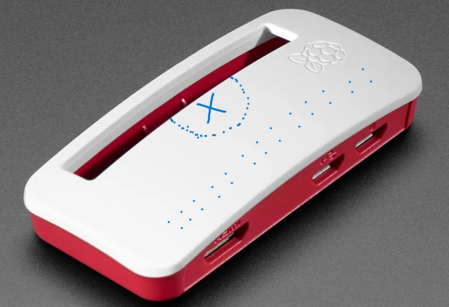

# 🌡️ RPiFan - Raspberry Pi Temperature Control System

<div align="center">


</div>

## 📋 Overview
RPiFan is an intelligent temperature control system for Raspberry Pi that automatically manages fan speed based on CPU temperature. The system provides efficient cooling while minimizing noise and power consumption.

## 🔥 Features
- **Automatic Temperature Monitoring**: Continuously monitors CPU temperature
- **Smart Fan Control**: Advanced PWM fan speed control with hysteresis
  - Full speed (100%) above 50°C
  - Gradual speed increase from 50% to 100% between 45°C and 50°C
  - Intelligent hysteresis control:
    - Fan activates at 45°C
    - Stays running until temperature drops below 42°C
    - Prevents rapid on/off cycling
  - Linear interpolation for smooth transitions
- **Resource Efficient**: Minimal CPU usage with 2-second polling interval
- **Safe Operation**: Includes fail-safes and proper GPIO cleanup

## 🛠️ Setup Instructions

### Hardware Setup
This project utilizes the following components:

- **Fan**: [Official Raspberry Pi 4 Case Fan](https://www.raspberrypi.com/products/raspberry-pi-4-case-fan/) (extracted from its original housing)
- **Case**: [Official Raspberry Pi Zero Case](https://robu.in/product/official-raspberry-pi-zero-case/)
- **Heatsinks**: Position heatsinks vertically as shown in the gallery images
  - Main processor heatsink should match or exceed the CPU chip dimensions for optimal heat transfer
  - Vertical alignment allows optimal airflow through the fins
  - Ensures maximum heat dissipation with the fan's airflow pattern
  - See gallery images for correct placement orientation

> 🔍 **Technical Notes on Cooling**:
> - The processor heatsink size is crucial - larger contact area with the CPU means better heat dissipation
> - While the SD card and its port don't generate significant heat themselves, they are connected to the PCB's ground plane (thick copper cladding). This connection causes the SD card port to heat up when the main PCB temperature rises. Adding an inexpensive aluminum heatsink (costing less than ₹20) over the SD card port helps dissipate this conducted heat more effectively, contributing to overall better thermal management.

- **Modification Details**:
  - Custom ventilation hole cut in the official case lid
  - Additional small ventilation holes in rows under the fan area for enhanced airflow
  - Holes pattern helps hot air exit more efficiently (see gallery for pattern details)
  - Fan mounted directly above the CPU using hot glue
  - Clean, professional finish maintaining the original case aesthetics

> 📸 *Reference images showing the modification process, ventilation hole pattern, heatsink placement, and final setup can be found in the gallery below*

### Gallery
<table>
  <tr>
    <td width="25%">
      
      <p align="center"><em>Inside</em></p>
    </td>
    <td width="25%">
      
      <p align="center"><em>Front View</em></p>
    </td>
    <td width="25%">
      
      <p align="center"><em>Top View</em></p>
    </td>
    <td width="25%">
      
      <p align="center"><em>Case Cutting Location</em></p>
    </td>
  </tr>
</table>

### Hardware Requirements
- **Platform**:
  - Developed and tested on Raspberry Pi Zero 2 W
  - Compatible with all Raspberry Pi Single Board Computers
- PWM-compatible cooling fan
- Connections:
  - PWM control wire to GPIO pin 12 (BCM mode)
  - Power wire to 5V pin
  - Ground wire to GND pin

### Software Installation
1. Clone the repository:
   ```bash
   git clone https://github.com/desiFish/RPiFan.git
   cd RPiFan
   ```

2. Make the service script executable:
   ```bash
   chmod +x fanService.sh
   ```

3. Set up automatic startup using crontab:
   ```bash
   sudo crontab -e
   ```
   Add the following line:
   ```bash
   @reboot /home/admin/projects/RPiFan/fanService.sh
   ```
   Save and exit nano editor:
   - Press `Ctrl + X` to exit
   - Press `Y` to confirm changes
   - Press `Enter` to save

> 💡 For detailed help with startup configuration, check out [this Instructables guide](https://www.instructables.com/Raspberry-Pi-Launch-Python-script-on-startup/)

## 🔧 Configuration
You can modify the following constants in `fan_control.py`:
- `TEMP_HIGH`: Temperature threshold for full speed (default: 50°C)
- `TEMP_MEDIUM`: Temperature threshold for half speed (default: 45°C)
- `TEMP_OFF`: Temperature threshold to turn off fan (default: 42°C)
- `PWM_FREQ`: PWM frequency in Hz (default: 25Hz)

## 🙏 Attribution
If you find this project useful and use it in your work, we kindly request that you include a reference back to this project. Whether you're:
- Writing a blog post
- Creating a video tutorial
- Publishing an article
- Building upon this work
- Sharing on social media

Please add a link to this repository. Your attribution, however small, helps our project grow and reach more makers in the community.

## 📝 License

This project is licensed under the GNU General Public License v3.0 (GPLv3).

### Key points of the GPLv3 License:
- ✔️ Freedom to use the software for any purpose
- ✔️ Freedom to change the software to suit your needs
- ✔️ Freedom to share the software with your friends and neighbors
- ✔️ Freedom to share the changes you make

For more details, see the [GNU General Public License v3.0](https://www.gnu.org/licenses/gpl-3.0.en.html).

---
<div align="center">
Made with ❤️ for Raspberry Pi Community
</div>